# Project 1: DNS Reflection and Amplification Attacks

## socket

socket 可以讓不同 process 或是不同機器間進行通訊, 更精確的說法是可以讓任何使用 **standard Unix file descriptors** 的裝置進行通訊(ps. 我們知道在 linux 之下所有東西都是 file, 所有 IO action 都是用讀寫 file descriptors 完成的, 而實際上它以 integer 表示, 詳細內容可以參考[Linux 的 file descriptor 筆記](https://kkc.github.io/2020/08/22/file-descriptor/)以及[What are file descriptors, explained in simple terms?](https://stackoverflow.com/questions/5256599/what-are-file-descriptors-explained-in-simple-terms)

socket types 分為四類:

1. Stream Sockets
2. Datagram Sockets
3. Raw Sockets 
4. Sequenced Packet Sockets

* Stream Sockets

	* 使用 TCP 傳輸資料, 在網路環境中保證 delivery, 例如依照順序傳送 "A,B,C" 三筆資料時, 將保證以相同順序抵達。如果沒辦法達成的話將回傳錯誤

* Data Sockets

	* 使用 UDP 因此無法保證會正常傳輸資料, 但是不用像 Stream Sockets 打開連結(connectionless)

* Raw Sockets

* Sequenced Packet Sockets

### The client server model

大部分的網路應用程式都是以 client-server 架構使得兩個 processes 或是兩個應用程式可以互相傳遞資訊, 其中一者會作為 client, 另一者為 server

* client 
	* clent process 主要會發送 request 並接收 response 來獲得資訊
	* ex: Browser 作為 client application 向 Web server 發送 request 進而透得 HTML 內容

* server
	* server process 主要處理 request 並將 request 所需要的內容蒐集起來後回覆給 client process, 結束後繼續服務其他 request
	* ex: Web server 將會等待任何的 request, 一旦有任何發現 request 就回覆相對應的檔案內容(HTML~)

* architectures
	* 2-tier architecture
		* client 可直接與 server 進行互動, 這種設計會有安全漏洞的風險與效能問題
		* 瀏覽器與 web server 採用此架構, 但以 Secure Socket Layer(SSL) 解決安全問題
	* 3-tier architectures
		* 在 client 與　server 間多一層 middleware, middle ware 會負責安全檢查與 load balance

<div>
    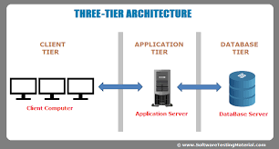
    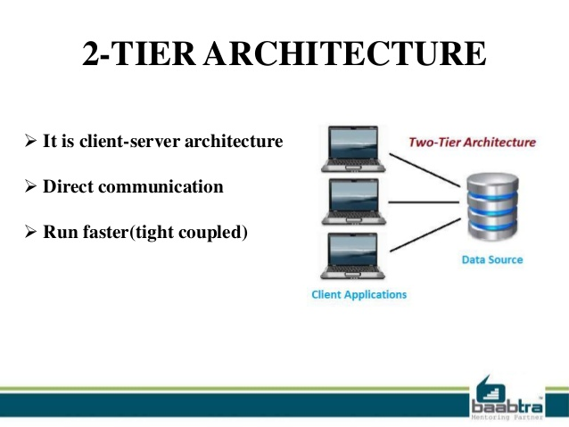
</div>

* server types
	* Iterative Server
		* server 一次服務一個 process
	* Concurrent Servers
		* server 一次服務多個 process
		* 最簡單的方式是使用 ```fork``` 以 child process 去 handle client

### make client

1. 使用 ```socket()```  create socket
2. 使用 ```connect()``` 將 socket 連接至 server address
3. 使用 ```read()``` 與 ```write()``` 傳送與接收資料

### make server

1. 使用 ```socket()```  create socket
2. 使用 ```bind()``` 將 socket 綁定到 address
3. 使用 ```listen()``` 進行監聽
4. 使用 ```accept()``` 接受連接
5. 使用 ```read()``` 與 ```write()``` 傳送與接收資料

[實做細節於下面 socket core function](#socket-core-function)

<div>
    
</div>

---

### socket structure 

不同協議需要指定 socket address 作為參數, 然而不同協議之間有不同的 address struct 定義, 在許多 Unix/Linux 作業系統裡為了能讓多種不同的協議都能正常運作, 定義出了 ```sockaddr``` 這種 address structure. 可以在不同協議之間進行強制轉換

常見的三種 address format:
1. sockaddr : Unix 作業系統格式（AF_UNIX）
2. sockaddr_in : Internet 網路格式（AF_INET)
3. sockaddr_un : 本機迴授位址（Loopback）格式（AF_UNIX）

* sockaddr
	* 用來表達 socket 的資訊
	* 如上述它可以在不同協議之間進行轉換, 引此所有的 socket function 幾乎都使用這個 struct 作為參數, 例如 create socket 的 [socket()](#socket-core-function)
	*			
		```c
		struct sockaddr {
		    unsigned short   sa_family;
		    char             sa_data[14];
		};
		```
	 	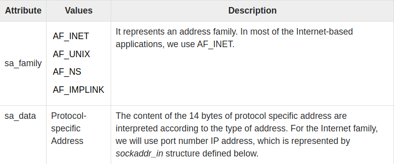

* sockaddr in
	* ```sockaddr_in``` 比起 ```sockaddr``` 多了 ip address 與 port 等等資訊.
	* 應該使用 ```sockaddr_in``` 來表示 address, 而非使用 ```sockaddr```, ```sockaddr``` 是給 OS 使用的

		```c
		struct sockaddr_in {
			short int            sin_family;
			unsigned short int   sin_port;
			struct in_addr       sin_addr;
			unsigned char        sin_zero[8];
		};
		```

		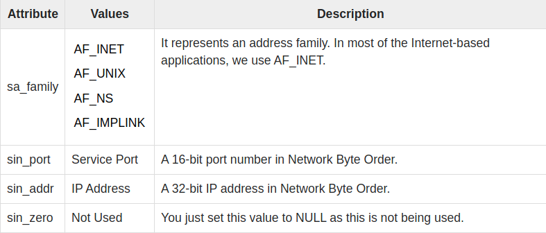
	
	* 來自 [CSDN : sockaddr和sockaddr_in的區別 ](https://blog.csdn.net/tao546377318/article/details/72780685)的例子:

		```c
		int sockfd;  
		struct sockaddr_in servaddr;  
		
		sockfd = Socket(AF_INET, SOCK_STREAM, 0);  
		
		/* 填充struct sockaddr_in */  
		bzero(&servaddr, sizeof(servaddr));  
		servaddr.sin_family = AF_INET;  
		servaddr.sin_port = htons(SERV_PORT);  
		inet_pton(AF_INET, "127.0.0.1", &servaddr.sin_addr);  
		
		/* 强制转换成struct sockaddr */  
		connect(sockfd, (struct sockaddr *) &servaddr, sizeof(servaddr));
		```

* in_addr
	 
	* 用來表達 32 bit 的 IPv4 address

		```c
		struct in_addr {
			unsigned long s_addr;
		};
		```	

		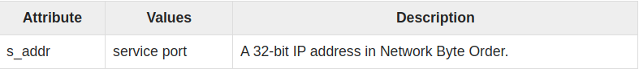

* hostent
	
	```c
	struct hostent {
	    char *h_name; 
	    char **h_aliases; 
	    int h_addrtype;  
	    int h_length;    
	    char **h_addr_list
		
	#define h_addr  h_addr_list[0]
	};
	```

	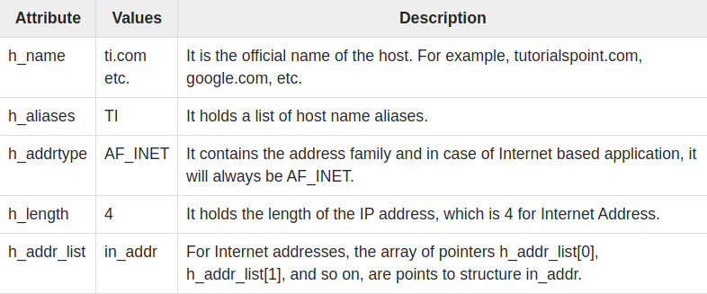

* servent

	```c
	struct servent {
	    char  *s_name; 
	    char  **s_aliases; 
	    int   s_port;  
	    char  *s_proto;
	};
	```

	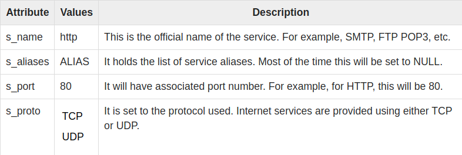


* int **inet_aton**(const char *strptr, struct in_addr *addrptr)
	* 作用 : 將 string literal 轉換為 network address 後儲存於第二個 structure type 的參數中
	* 轉換後的型態為 [network byte order](#network-byte-order)
	* return 1 : valid
	* return 0 : invalid

	<br>

	```c
	int retval;
	struct in_addr addrptr

	memset(&addrptr, '\0', sizeof(addrptr));
	retval = inet_aton("68.178.157.132", &addrptr);
	```

* in_addr_t **inet_addr**(const char *strptr)
	* 作用: 將 string linteral 轉換為十進位數字
	* 轉換後為 [network byte order](#network-byte-order)
	* example:
		```c
		#include <arpa/inet.h>
		#include <bits/stdc++.h>
		using namespace std;

		int main(){

		    struct sockaddr_in dest;

		    memset(&dest, '\0', sizeof(dest));
		    dest.sin_addr.s_addr = inet_addr("68.178.157.132");

		    cout<<hex<<68<<endl;
		    cout<<hex<<178<<endl;
		    cout<<hex<<157<<endl;
		    cout<<hex<<132<<endl;
		    cout<<hex<<dest.sin_addr.s_addr<<endl;

		    return 0;
		}
		```

	* the result: 
		```
		44
		b2
		9d
		84
		849db244
		```

	可以轉換後為 big endian, 大部份 protocal 也為 big endian


* char* **inet_ntoa**(struct in_addr inaddr)

	* 作用: 將 host address 轉換為 string 
	* example:

		```c
		#include <arpa/inet.h>
		#include <bits/stdc++.h>
		using namespace std;

		int main(){

			char *ip;
			struct  sockaddr_in dest;

			ip = inet_ntoa(dest.sin_addr);
			printf("IP Address is: %s\n",ip);

			dest.sin_addr.s_addr = inet_addr("123.123.123.123");
			ip = inet_ntoa(dest.sin_addr);
			printf("IP Address is: %s\n",ip);
			
			return 0;
		}
		```

	* the result: 
		```
		IP Address is: 0.0.0.0
		IP Address is: 123.123.123.123
		```


### Network Byte Order

我們知道不同電腦架構中會有 Little Endian 與 Big Endian 兩種架構(參考下面圖例)

<div>
    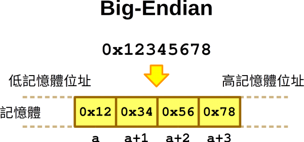
    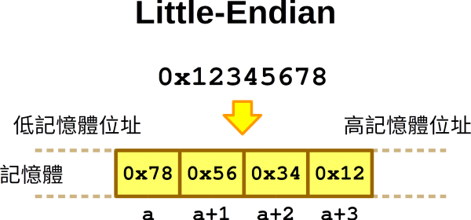
</div>

<br>

網路中一樣有此概念, protocal 會說明在傳輸時的 Byte Order 為何, **大部分為 Big Endian**, 然而在電腦與電腦傳輸前都需要先將自己電腦的 byte order(**Host Byte Order**) 轉換為 Network Byte Order 才可以正常傳輸, socket 中定義好了 function 可以做轉換,(如果 host byte order 已為 big endian 則不需要做轉換)

|Function|Description|
|---|---|
|htons()|Host to Network Short|
|htonl()|Host to Network Long|
|ntohl()|Network to Host Long|
|ntohs()|Network to Host Short|

function define:

```c
unsigned short htons(unsigned short hostshort) 
// This function converts 16-bit (2-byte) quantities 
// from host byte order to network byte order.

unsigned long htonl(unsigned long hostlong)
// This function converts 32-bit (4-byte) quantities
// from host byte order to network byte order.

unsigned short ntohs(unsigned short netshort) 
// This function converts 16-bit (2-byte) quantities 
// from network byte order to host byte order.

unsigned long ntohl(unsigned long netlong)
// This function converts 32-bit quantities 
// from network byte order to host byte order.
```

---

## socket core function

在上面我們提過 [socket server 與 client 的工作流程與各自公用](#the-client-server-model), 這裡將描述核心 functiton 如何使用

### socket()

* ```int socket (int family, int type, int protocol);```
* 功用 : create socket
* 各項詳細說明可以看[這份文件](https://sock-raw.org/papers/sock_raw), [這份文件](https://man7.org/linux/man-pages/man7/raw.7.html), [以及這份文件](https://linux.die.net/man/7/raw), 下面僅會列出部份內容:


<details>
	<summary><b>sock_type</b> click to expand</summary>

```c
// Linux defines these constants in /usr/src/linux-2.6.*/include/linux/socket.h

/* Supported address families. */
#define AF_UNSPEC	0
#define AF_UNIX		1	/* Unix domain sockets 		*/
#define AF_LOCAL	1	/* POSIX name for AF_UNIX	*/
#define AF_INET		2	/* Internet IP Protocol 	*/

/* Protocol families, same as address families. */
#define PF_UNSPEC	AF_UNSPEC
#define PF_UNIX		AF_UNIX
#define PF_LOCAL	AF_LOCAL
#define PF_INET		AF_INET
```
</details>

<details>
	<summary><b>sock_type</b> click to expand</summary>

```c
// Linux defines the internet family protocol types in /usr/src/linux-2.6.*/include/linux/net.h

enum sock_type {
    SOCK_STREAM	= 1,
    SOCK_DGRAM	= 2,
    SOCK_RAW	= 3,
    SOCK_RDM	= 4,
    SOCK_SEQPACKET	= 5,
    SOCK_DCCP	= 6,
    SOCK_PACKET	= 10,
};
```

</details>

<details>
	<summary><b>protocol</b> click to expand</summary>

```c
// Linux defines these protocols in /usr/src/linux-2.6.*/include/linux/in.h

/* Standard well-defined IP protocols.  */

enum {
    IPPROTO_IP = 0,			/* Dummy protocol for TCP		*/
    IPPROTO_ICMP = 1,		/* Internet Control Message Protocol	*/
    IPPROTO_IGMP = 2,		/* Internet Group Management Protocol	*/
    IPPROTO_IPIP = 4,		/* IPIP tunnels (older KA9Q tunnels use 94) */
    IPPROTO_TCP = 6,		/* Transmission Control Protocol	*/
    IPPROTO_EGP = 8,		/* Exterior Gateway Protocol		*/
    IPPROTO_PUP = 12,		/* PUP protocol				*/
    IPPROTO_UDP = 17,		/* User Datagram Protocol		*/
    IPPROTO_IDP = 22,		/* XNS IDP protocol			*/
    IPPROTO_DCCP = 33,		/* Datagram Congestion Control Protocol */
    IPPROTO_RSVP = 46,		/* RSVP protocol			*/
    IPPROTO_GRE = 47,		/* Cisco GRE tunnels (rfc 1701,1702)	*/
    IPPROTO_IPV6 = 41,		/* IPv6-in-IPv4 tunnelling		*/
    IPPROTO_ESP = 50,       	/* Encapsulation Security Payload protocol */
    IPPROTO_AH = 51,             	/* Authentication Header protocol       */
    IPPROTO_BEETPH = 94,	       	/* IP option pseudo header for BEET */
    IPPROTO_PIM    = 103,		/* Protocol Independent Multicast	*/
    IPPROTO_COMP   = 108,           /* Compression Header protocol */
    IPPROTO_SCTP   = 132,		/* Stream Control Transport Protocol	*/
    IPPROTO_UDPLITE = 136,		/* UDP-Lite (RFC 3828)			*/
    IPPROTO_RAW	 = 255,		/* Raw IP packets			*/
    IPPROTO_MAX
};
```

</details>


### connect()

* ```int connect(int sockfd, struct sockaddr *serv_addr, int addrlen);```
* 作用: TCP client 使用於與 TCP server 建立連線
* **sockfd** : ```socket()``` return 的 socket descipter
* **serv_addr** : 指向含有 **destination** ip 與 port 之 struct sockaddr 的 pointer
* **addrlen** : sizeof(struct sockaddr)

### bind()

* ```int bind(int sockfd, struct sockaddr *my_addr,int addrlen);```
* 作用 : TCP server 將 local protocal address 與 socket 連接
* return 0 : valid
* rerurn -1: error
* **sockfd** : ```socket()``` return 的 socket descipter
* **my_addr** : 指向含有 **lcoal** ip 與 port 之 struct sockaddr 的 pointer
* **addrlen** : sizeof(struct sockaddr)

* 自動填入 ip 與 port:
	```c
	server.sin_port = 0;  		     
	// random choose port
	server.sin_addr.s_addr = INADDR_ANY;
	// random choose ip
	```

### listen()
```c
int listen(int sockfd,int backlog);
```
* 作用: TCP server 用來將 unconnected socket 轉變為 passive socket, 表示 kernel 現在會接收連接的 socket 所傳進來的 request
* **sockfd** : ```socket()``` return 的 socket descipter
* **backlog** : 允許連接的數量

### send()
```c
int send(int sockfd, const void *msg, int len, int flags);
```
* 傳送 data 給 **CONNECTED** 的 sockets
* return -1 : error
* **sockfd** : ```socket()``` return 的 socket descipter
* **msg** : a pointer to 要傳送的 data
* **len** : data 的長度(bytes)
* **flags** : set to 0

### sendto()
```c
int sendto(int sockfd, const void *msg, int len, unsigned int flags, 
           const struct sockaddr *to, int tolen);
```
* 傳送資料給 **UNCONNECTED** sockets
* return -1 : error
* **sockfd** : ```socket()``` return 的 socket descipter
* **msg** : a pointer to 要傳送的 data
* **len** : data 的長度(bytes)
* **flags** : set to 0
* **to** : pointer to struct sockaddr for the host where data has to be sent.
* **tolen** : sizeof(struct sockaddr)

### recv()
```c
int recv(int sockfd, void *buf, int len, unsigned int flags);
```
* 作用 : 接收 **CONNECTED**  socket 所傳送的資料
* **sockfd** : ```socket()``` return 的 socket descipter
* **buf** : 接收資料的 buffer
* **len** : buffer max 長度
* **flags** : set to 0

### recvfrom()
* 作用 : 接收 **UNCONNECTED**  socket 所傳送的資料
```c
int recvfrom(int sockfd, void *buf, int len, unsigned int flags,
	     struct sockaddr *from, int *fromlen);
```
* **sockfd** : ```socket()``` return 的 socket descipter
* **buf** : 接收資料的 buffer
* **len** : buffer max 長度
* **flags** : set to 0
* **from** : pointer to struct sockaddr for the host where data has to be read.
* **fromlen** : sizeof(struct sockaddr)

---

## raw socket

### non-raw socket : 

在 application 傳輸資料的過程中, 會需要經由一層層 layer 包裝 packet, 包含加上 source ip address, destination ip address等; 而在接收端, 我們收到 packet 之後要將 packet 的 header 給拆掉並根據 protocal 往上傳遞給各層後最後將 data 傳給 application。

如下圖 non-raw socket 可以繞過 OSI model 將 package 送到 application 中, 因此可以實現 sniffer, IP Spoofing Packets 等功能, 注意 **raw socket requires superuser rights** !!!

<div>
    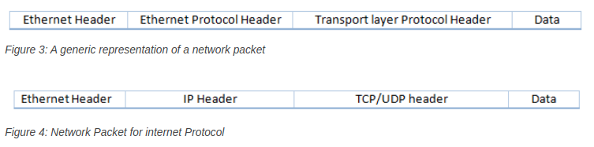
    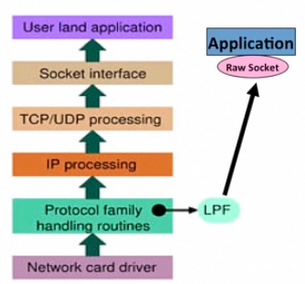
</div>

### open a raw socket

如果要 open socket 必須要知道三個參數:
1. socket family
2. socket type
3. protocol

然而 raw socket 的 socket family 為 ```AF_PACKET```, socket type 為 ```SOCK_RAW ```, 所以 raw socket is created by calling the ```socket``` syscall :

```c
raw_socket = socket(AF_INET, SOCK_RAW, int protocol);
```

<details>
	<summary>Using raw socket implement ping<summary>
	
</details>

---

## check

* [ ] 要提供 makefile 且命名為 **dns_attack**
* [ ] 確保可以在乾淨 VM 下執行(不可以有依賴其他 Library )
* [ ] Report 字數
* [ ] Report 檔名為: report.pdf 
* [ ] Report 字體: Times New
Roman
* [ ] Report font-size: 11 Or 12

## source

* 重要文件:
	* [papers : SOCK_RAW](https://sock-raw.org/papers/sock_raw) 
	* [linux man-pages](https://man7.org/linux/man-pages/man7/raw.7.html)
	* [linux.die.net](https://linux.die.net/man/7/raw)

* [tutorialspoint : Unix Socket Tutorial](https://www.tutorialspoint.com/unix_sockets/index.htm)
* [CSDN : sockaddr和sockaddr_in的區別 ](https://blog.csdn.net/tao546377318/article/details/72780685)
* [stackoverflow : what is RAW socket in socket programming](https://stackoverflow.com/questions/14774668/what-is-raw-socket-in-socket-programming)
* [A Guide to Using Raw Sockets](https://www.opensourceforu.com/2015/03/a-guide-to-using-raw-sockets/)
