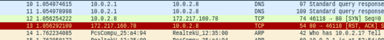

# Project II: MITM and Pharming Attacks in Wi-Fi Networks

## mitm_attack

* Print out the IP/MAC addresses of all the Wi-Fi devices or VMs except for Attacker and AP/Host

* Print out the username and password which a user submits to the website https://e3.nycu.edu.tw/login/index.php using any of the Wi-Fi devices or VMs


### show IP/MAC address

此次作業中兩者首要之務皆為要求先 print 所有與 AP 連線的裝置的 IP/MAC address, 所給的 HINT 為可以使用: **‘scapy’ and ‘netifaces’ library in Python** or **commands ‘nmap’,‘arp’, and ‘route’**

這邊選擇使用 nmap, 先確定我們可以透過:

```
$ sudo nmap -sn 192.168.1.0/24
```

獲得所有目前相同網段的裝置 ip 與 ip address, **注意只有在 sudo 權限下才能夠顯示出 MAC address**, 可以參考 [stackoverflow : is it possible to get the MAC address for machine using nmap](https://stackoverflow.com/questions/13212187/is-it-possible-to-get-the-mac-address-for-machine-using-nmap)中:

> sudo is important. Without sudo, you won't get the MAC address output line


### packet forwarding

在上面設定完而且開啟 linux 的 ip forwarding 功能後:

```
$ echo 1 > /proc/sys/net/ipv4/ip_forward
```

上面重開啟後會被 reset 為0, 使用下面指令將直接永遠開啟讓 device 有 router 的功能:

```
$ sysctl -w net.ipv4.ip_forward=1
```

victim 用 ping 發現可以正常收到回應, 但是開啟瀏覽器卻發現沒辦法正常上網, 在 attacker 上用 wireshark 初步診斷問題, 發現 tcp 封包根本沒有轉送出去, 原本希望的路徑是: victim --> attacker --> web server, 但 attacker 收到 tcp 封包後直接回傳 ACK-RST 給 victim 中斷連線:



### sslsplit

* install:

    ```
    $ sudo apt-get update -y
    $ sudo apt-get install -y sslsplit
    ```

---

## pharming attack

* NetfilterQueue:

    * install:
        * **does not support Python3.6+**, last release is 2017 = =
        * ```pip3 install NetfilterQueue```
    * API:
        * [NetfilterQueue 0.8.1](https://pypi.org/project/NetfilterQueue/)


## report link : https://docs.google.com/document/d/1UMfpEAWTXPlP57mHasa24kYqOxnc_tftqwv1ILeY5Hk/edit
